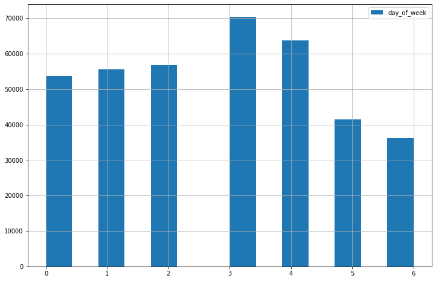

# Ch00 - Pandas Exercises


__Welcome to the practice exercises for chapter 00!__

The exercises are divided into three parts, gradually increasing in difficulty. Are you up to the challenge? 

The three exercises uses slightly different techniques, and different datasets.

It is recommended to use what you know and the listed resources to complete as many exercises as possible before asking for assistance.

__Enjoy!__

---

**Tips and tricks:**
<ul>
    <li/> Pandas documentation: <a>https://pandas.pydata.org/docs/user_guide/index.html#user-guide</a>
    <li/> Pandas and data-wrangling cook-book: <a>https://chrisalbon.com/</a>
</ul>

**Content:**

* [Basic exercises](#basic)
* [Medium exercises](#medium)
* [Challenging exercises](#challenge)

---


## Level: Basic<a class="anchor" id="basic"></a>

__Task 1:__

Import data from this website
https://raw.githubusercontent.com/justmarkham/DAT8/master/data/u.user and assign it to a dataframe called `users`.


```python
import pandas as pd
import numpy as np

# Enter your code below
# =====================

users = pd.read_csv(
    'https://raw.githubusercontent.com/justmarkham/DAT8/master/data/u.user', 
    sep='|'
)
```

__Task 2:__


Explore the data.
<ol>
    <li/> Display (print on screen) the first 25 entries (rows)
    <li/> Display (print on screen) the last 10 entires (rows)
    <li/> Find the number of rows and columns in dataset
</ol>


```python
# Enter your code below
# =====================

# A)

print('First 25 rows: \n')
print(users.head(25))

# B)

print('Last 10 rows: \n')
print(users.tail(10))

# C)

print(f'\nNumber of rows: {users.shape[0]}, number of columns: {users.shape[1]}')
```

    First 25 rows: 
    
        user_id  age gender     occupation zip_code
    0         1   24      M     technician    85711
    1         2   53      F          other    94043
    2         3   23      M         writer    32067
    3         4   24      M     technician    43537
    4         5   33      F          other    15213
    5         6   42      M      executive    98101
    6         7   57      M  administrator    91344
    7         8   36      M  administrator    05201
    8         9   29      M        student    01002
    9        10   53      M         lawyer    90703
    10       11   39      F          other    30329
    11       12   28      F          other    06405
    12       13   47      M       educator    29206
    13       14   45      M      scientist    55106
    14       15   49      F       educator    97301
    15       16   21      M  entertainment    10309
    16       17   30      M     programmer    06355
    17       18   35      F          other    37212
    18       19   40      M      librarian    02138
    19       20   42      F      homemaker    95660
    20       21   26      M         writer    30068
    21       22   25      M         writer    40206
    22       23   30      F         artist    48197
    23       24   21      F         artist    94533
    24       25   39      M       engineer    55107
    Last 10 rows: 
    
         user_id  age gender     occupation zip_code
    933      934   61      M       engineer    22902
    934      935   42      M         doctor    66221
    935      936   24      M          other    32789
    936      937   48      M       educator    98072
    937      938   38      F     technician    55038
    938      939   26      F        student    33319
    939      940   32      M  administrator    02215
    940      941   20      M        student    97229
    941      942   48      F      librarian    78209
    942      943   22      M        student    77841
    
    Number of rows: 943, number of columns: 5


__Task 3:__

Explore columns and rows
<ol>
    <li/> Print names of columns
    <li/> Print names of rows (index)
    <li/> Find data type of each column
</ol>


```python
# Enter your code below
# =====================

# A)

print('Columns: \n')
print(users.columns)

# B)

print('\nRows / Index: \n')
print(users.index)

# C)

print('\nDtype info: \n')
print(users.info())
```

    Columns: 
    
    Index(['user_id', 'age', 'gender', 'occupation', 'zip_code'], dtype='object')
    
    Rows / Index: 
    
    RangeIndex(start=0, stop=943, step=1)
    
    Dtype info: 
    
    <class 'pandas.core.frame.DataFrame'>
    RangeIndex: 943 entries, 0 to 942
    Data columns (total 5 columns):
     #   Column      Non-Null Count  Dtype 
    ---  ------      --------------  ----- 
     0   user_id     943 non-null    int64 
     1   age         943 non-null    int64 
     2   gender      943 non-null    object
     3   occupation  943 non-null    object
     4   zip_code    943 non-null    object
    dtypes: int64(2), object(3)
    memory usage: 37.0+ KB
    None


__Task 4:__

Explore a single column
<ol>
    <li/> Print the 'occupation' column
    <li/> Find the number of different occupations in the dataset
    <li/> What is the most frequent occupation?
</ol>


```python
# Enter your code below
# =====================

occupations = users.occupation

# A)

print('\nUser occupations:\n')
print(occupations)

# B)

print(f'\nNumber of unique occupations: {occupations.nunique()}')

# C)

# Using value_counts() will sort the occurences from most frequent to least.
most_frequent_occupation = occupations.value_counts().index[0]
print(f'The most frequent occupation is: {most_frequent_occupation}')
```

    
    User occupations:
    
    0         technician
    1              other
    2             writer
    3         technician
    4              other
               ...      
    938          student
    939    administrator
    940          student
    941        librarian
    942          student
    Name: occupation, Length: 943, dtype: object
    
    Number of unique occupations: 21
    The most frequent occupation is: student


__Task 5:__

Lets summarize
<ol>
    <li/> Summarise the dataframe
    <li/> Summarize the dataframe column by column in a loop. What information is available here that is missing in the previous task?
</ol>


```python
# Enter your code below
# =====================

# A)

print('\nSummary of users dataframe:\n')
print(users.describe())

# B)

print('\nSummary of users column by column:\n')
for col in users.columns:
    print(users[col].describe())
```

    
    Summary of users dataframe:
    
              user_id         age
    count  943.000000  943.000000
    mean   472.000000   34.051962
    std    272.364951   12.192740
    min      1.000000    7.000000
    25%    236.500000   25.000000
    50%    472.000000   31.000000
    75%    707.500000   43.000000
    max    943.000000   73.000000
    
    Summary of users column by column:
    
    count    943.000000
    mean     472.000000
    std      272.364951
    min        1.000000
    25%      236.500000
    50%      472.000000
    75%      707.500000
    max      943.000000
    Name: user_id, dtype: float64
    count    943.000000
    mean      34.051962
    std       12.192740
    min        7.000000
    25%       25.000000
    50%       31.000000
    75%       43.000000
    max       73.000000
    Name: age, dtype: float64
    count     943
    unique      2
    top         M
    freq      670
    Name: gender, dtype: object
    count         943
    unique         21
    top       student
    freq          196
    Name: occupation, dtype: object
    count       943
    unique      795
    top       55414
    freq          9
    Name: zip_code, dtype: object


__Task 6:__

Explore the age variable
<ol>
    <li/> What is the mean age of users?
    <li/> What is/are the age(s) with least occurence(s)?
</ol>


```python
# Enter your code below
# =====================

# A)

mean_age = users.describe()['age']['mean']

print(f'Mean age of users: {mean_age}')

# B)

ages = users.age
age_values = ages.value_counts()  # print out value_counts() and see for yourself
min_count = min(age_values)

# We find all ages with the minimum number of occurences and sort them
least_frequent_ages = sorted(tuple(age_values[age_values == min_count].index))

print(f'Least frequent ages: {least_frequent_ages} with {min_count} occurence(s)')
```

    Mean age of users: 34.05196182396607
    Least frequent ages: [7, 10, 11, 66, 73] with 1 occurence(s)


---


## Level: Medium <a class="anchor" id="medium"></a>

__Task 1:__

Go to https://www.kaggle.com/openfoodfacts/world-food-facts/data, download and unzip the data. Assign the TSV file to a dataframe called `food`. (Hint: `sep` parameter in `read_csv`)


```python
# Enter your code below
# =====================

food = pd.read_csv('foods.tsv', sep='\t')
```

    /home/halper/Documents/dat200_work/dat200_venv/lib/python3.8/site-packages/IPython/core/interactiveshell.py:3146: DtypeWarning: Columns (0,3,5,19,20,24,25,26,27,28,36,37,38,39,48) have mixed types.Specify dtype option on import or set low_memory=False.
      has_raised = await self.run_ast_nodes(code_ast.body, cell_name,


__Task 2:__

Explore the dataset. 
<ol>
    <li/> Print the FIRST 10 rows with columns 5, 6, 7 (hint: iloc)
    <li/> How many observations are there?
    <li/> How many columns are there?
    <li/> How is the dataset indexed?
</ol>


```python
# Enter your code below
# =====================

# A)

print('First ten rows:\n')
print(food.iloc[:10, 5:8])

# B)
print(f'\nNumber of observations: {food.shape[0]}')

# C)
print(f'\nNumber of columns: {len(food.columns)}')

# D)
print('\nIndex: ', food.index)
```

    First ten rows:
    
      last_modified_t last_modified_datetime                       product_name
    0      1474103893   2016-09-17T09:18:13Z                 Farine de blé noir
    1      1489069957   2017-03-09T14:32:37Z     Banana Chips Sweetened (Whole)
    2      1489069957   2017-03-09T14:32:37Z                            Peanuts
    3      1489055731   2017-03-09T10:35:31Z             Organic Salted Nut Mix
    4      1489055653   2017-03-09T10:34:13Z                    Organic Polenta
    5      1489055651   2017-03-09T10:34:11Z  Breadshop Honey Gone Nuts Granola
    6      1489055730   2017-03-09T10:35:30Z      Organic Long Grain White Rice
    7      1489055712   2017-03-09T10:35:12Z                     Organic Muesli
    8      1489055651   2017-03-09T10:34:11Z       Organic Dark Chocolate Minis
    9      1489055654   2017-03-09T10:34:14Z              Organic Sunflower Oil
    
    Number of observations: 356027
    
    Number of columns: 163
    
    Index:  RangeIndex(start=0, stop=356027, step=1)


__Task 3:__

Explore the columns.
<ol>
    <li/> Use a for-loop to print the names of all the columns
    <li/> Print the name of the 105th column
    <li/> Print the dtype of the 105th column
</ol>


```python
# Enter your code below
# =====================

# A)

# for col in food.columns:
#     print(col)
    
# B)

print(f'105th column name: {food.iloc[:, 105].name}')

# C)

print(f'105th column dtype: {food.iloc[:, 105].dtype}')
```

    105th column name: -fructose_100g
    105th column dtype: float64


__Task 4:__

What is the product name of the 19th observation?


```python
# Enter your code below
# =====================

print(f'Name of the 19th observation: {food.iloc[19, :].product_name}')
```

    Name of the 19th observation: Organic Oat Groats


__Task 5:__

Explore the realm of peanuts!
<ol>
    <li/> How many entries have a product name of 'Peanuts'?
    <li/> How many unique 'creator' values are associated with  the peanut-entries?
    <li/> Which creator is most frequent, and what is the number of entries from this creator in the peanut entries?
</ol>


```python
# Enter your code below
# =====================

# A)

peanut_entries = food[food.product_name == 'Peanuts']
num_peanuts = peanut_entries.shape[0]
print(f'Number of occurences with product name of Peanuts: {num_peanuts}\n')

# B)

unique_creators = peanut_entries.creator.nunique()
print(f'Number of unique creators: {unique_creators}\n')

# C)
peanut_creators = peanut_entries.creator.value_counts()
# One can also just print the value_counts() and look at the numbers
print(f'The most frequent creator is {peanut_creators.index[0]} with {peanut_creators[0]} out of {num_peanuts} entries.')

```

    Number of occurences with product name of Peanuts: 60
    
    Number of unique creators: 3
    
    The most frequent creator is usda-ndb-import with 56 out of 60 entries.


---


## Level: Challenging <a class="anchor" id="challenge"></a>

__Task 1:__

Use the following URL to save the Bysykkel JSON dataset to a dataframe called `trips_df`: https://data-legacy.urbansharing.com/oslobysykkel.no/2016/09.json.zip. Familiarize yourself with the dataset.


```python
# Enter your code below
# =====================

# Using read_json as opposed to read_csv
trips_data = pd.read_json('https://data-legacy.urbansharing.com/oslobysykkel.no/2016/09.json.zip')
# Use json_normalize to convert JSON dict object to dataframe
trips_df = pd.json_normalize(trips_data.trips)
```

__Task 2:__

Use the `groupby` and `agg` methods to create a new dataframe, called `'trips_df_agg'` by aggregating the data by `start_station_id`.
   The aggregated dataframe should have the following index and columns:


* Index: `start_station_id`
* Column `'trip_count'`: Count of trips made from this station
* Column `'first_trip'`: First recorded trip made from this station (start timestamp)
* Column `'last_trip'`: Last recorded trip made from this station (start timestamp)


```python
# Enter your code below
# =====================

# Aggregating the dataframe
trips_df_agg = trips_df.groupby('start_station_id').agg(
    trip_count = ('start_time', 'count'),  # Count an arbitrary event
    first_trip = ('start_time', 'min'),  # Find "smallest" timestamp
    last_trip = ('start_time', 'max')  # Find "biggest" timestamp
)
```

__Task 3:__

Now sort the `trips_df_agg` dataframe by your `trip_count` column, in descending order.


```python
# Enter your code below
# =====================

trips_df_agg = trips_df_agg.sort_values("trip_count", ascending=False)
```

__Task 4:__

Going back to `trips_df`:
<ol> 
    <li/> Convert the datatypes of time-based columns to 'datetime64'
    <li/> Create a new column called 'day_of_week', containing the day number of the week for the entry. 
</ol>    

(Hint: Use the `.weekday()` function built into datetime objects)
    


```python
# Enter your code below
# =====================

# A) Convert timestamps datatype
trips_df.start_time = trips_df['start_time'].astype('datetime64')
trips_df.end_time = trips_df['end_time'].astype('datetime64')

# B) Add 'day_of_week' column. 0 == Monday, 6 == Sunday.
trips_df['day_of_week'] = [day.weekday() for day in trips_df.start_time]
```

__Task 5:__

Which two days of the week have the highest activity levels? 
<ol>
    <li/>Use a histogram to observe `week_day` frequencies.
    <li/>Use a list of weekday names and value_counts() to create a dictionary of type: {'monday': 3255 ... }


```python
# Enter your code below
# =====================

# A) Frequency histogram
print(trips_df.day_of_week.hist(
    figsize=(12,8),
    bins=14,
    legend=True
))

# B) Create dict of counts
weekday_names = ['mon', 'tue', 'wed', 'thu', 'fri', 'sat', 'sun']
weekday_counts = trips_df.day_of_week.value_counts()

count_dict = {weekday_names[i]: weekday_counts[i] for i in weekday_counts.index}
print('Dictionary of trip frequencies by day: ')
print(count_dict)
```

    AxesSubplot(0.125,0.125;0.775x0.755)
    Dictionary of trip frequencies by day: 
    {'thu': 70411, 'fri': 63698, 'wed': 56676, 'tue': 55503, 'mon': 53620, 'sat': 41516, 'sun': 36253}


    

    


___
___
